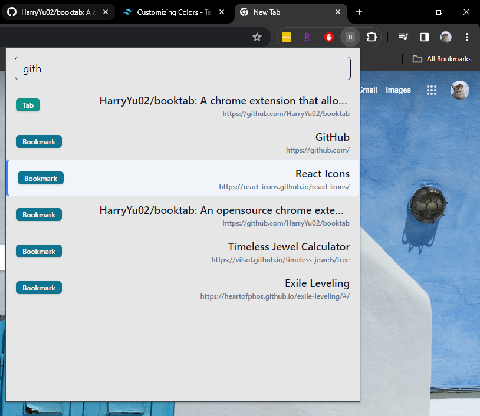

# BookTab

BookTab is a Chrome extension that allows users to quickly search and navigate through bookmarks, bookmark folders, and tabs using keyboard.



## Why creating BookTab

When I was doing some coding, I have many documentation opened and also some deeply nested bookmark, I find it very annoying to open the desired bookmark or navigate to a specific tab, so I wrap the Chrome Extenstion API for bookmarks and tabs together. There are also some work around like pressing Ctrl+Shift+A to search tabs, or press F6 and type @bookmark or @tabs to perform a search, but I am too lazy for that many buttons or mouse clicks, so I spent 2 days to automate a task that would have took me 10 seconds instead.

My usecase for BookTab is to run it using a Powershell Script to run it, save all the code documentations in a single folder so it doesnt clutter up my bookmark bar, and search for them when I need them.

## Technologies Used

-   [React](https://react.dev/)
-   [TypeScript](https://www.typescriptlang.org/)
-   [Vite](https://vitejs.dev/) (Build tool)
-   [Chrome Extension Manifest V3](https://developer.chrome.com/docs/extensions)
-   [CRXJS/vite-plugin](https://crxjs.dev/vite-plugin) (Support for Chrome Extension API)
-   [TailwindCSS](https://tailwindcss.com/)
-   [ShadcnUI](https://ui.shadcn.com/)

## Installation and Usage

To try out BookTab locally:

1. Clone the project repository.
2. Install all dependencies using `yarn install`.
3. Run the project locally using `yarn dev`.
4. Go to `chrome://extensions/`.
5. Enable Developer Mode.
6. Click "Load unpacked" and select the `dist` folder in the project directory.
7. Start using BookTab.

## Keyboard Shortcuts

BookTab supports the following keyboard shortcuts:

-   **Open Extension**: Ctrl+Shift+Space (Mac: MacCtrl+Shift+Space)
-   **Focus Search Bar**: Ctrl+Shift+Z (Mac: MacCtrl+Shift+Z)
-   **Move to Next Option**: Tab
-   **Move to Previous Option**: Shift+Tab
-   **Select Current Option**: Space / Enter

I have customize it so I can use left hand only, but you can customize them in manifest,json, while users can customize these shortcuts under `chrome://extensions/` > Keyboard Shortcut in the sidebar.

## Contributions

Contributions to BookTab are welcome! Here are a few ways you can contribute:

-   Fork the repository and submit a pull request.
-   Open an issue to report bugs or suggest improvements.

## Future Development

Currently, BookTab does not have any tests. Future development may include adding tests and setting up a CI/CD workflow. Additionally, containerizing the application with Docker and deploying it to chrome extension store could be explored.

## License

This project is licensed under the MIT License - see the [LICENSE](LICENSE) file for details.

<!-- # React + TypeScript + Vite

This template provides a minimal setup to get React working in Vite with HMR and some ESLint rules.

Currently, two official plugins are available:

-   [@vitejs/plugin-react](https://github.com/vitejs/vite-plugin-react/blob/main/packages/plugin-react/README.md) uses [Babel](https://babeljs.io/) for Fast Refresh
-   [@vitejs/plugin-react-swc](https://github.com/vitejs/vite-plugin-react-swc) uses [SWC](https://swc.rs/) for Fast Refresh

## Expanding the ESLint configuration

If you are developing a production application, we recommend updating the configuration to enable type aware lint rules:

-   Configure the top-level `parserOptions` property like this:

```js
export default {
    // other rules...
    parserOptions: {
        ecmaVersion: "latest",
        sourceType: "module",
        project: ["./tsconfig.json", "./tsconfig.node.json"],
        tsconfigRootDir: __dirname,
    },
};
```

-   Replace `plugin:@typescript-eslint/recommended` to `plugin:@typescript-eslint/recommended-type-checked` or `plugin:@typescript-eslint/strict-type-checked`
-   Optionally add `plugin:@typescript-eslint/stylistic-type-checked`
-   Install [eslint-plugin-react](https://github.com/jsx-eslint/eslint-plugin-react) and add `plugin:react/recommended` & `plugin:react/jsx-runtime` to the `extends` list -->
